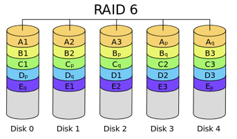
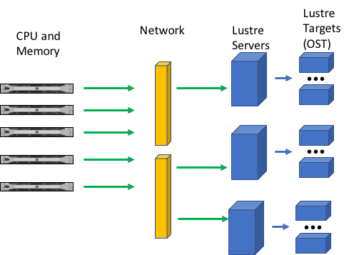

# How is data organized?

### File Systems

* Data is stored in a `File System`
  + Separates the data into pieces
  + Allows for naming of each pieces
  + Information is the isolated and identified


* Different `File Systems` appropriate for different physical media
  + hard disk drive, flash memory, magnetic tapes, optical discs, and network connected devices.
* Several common file systems in use in HPC

#### EXERCISE:
* What file systems are in use on `lonestar5` ?
  + let's use the `df` (disk free) command

```
$ df
Filesystem                                                1K-blocks          Used      Available Use% Mounted on
/dev/sda7                                                 962673920     108467284      805305620  12% /
udev                                                       65963776           220       65963556   1% /dev
tmpfs                                                      65963776          1132       65962644   1% /dev/shm
/dev/sda1                                                    521064        148588         346008  31% /boot
/dev/sda6                                                  33030972      22618936        8734112  73% /tmp
/dev/sda3                                                  66056896       4550064       58151236   8% /var
/dev/sda5                                                  24777596        176196       23342752   1% /var/crash
129.114.54.3:/opt/apps                                   3845218304    1353092096     2296800256  38% /opt/apps
129.114.54.5:/home1                                     13458257920    2000626688    10773991424  16% /home1
c3-dtn01.corral.tacc.utexas.edu:/gpfs/corral3/repl   12482248704000 6006356854784  6475891849216  49% /gpfs/corral3/repl
c3-5.corral.tacc.utexas.edu:/gpfs/corral3/tacc       12482248704000 6006356866048  6475891837952  49% /gpfs/corral3/tacc
10.10.100.10@o2ib1000:10.10.100.11@o2ib1000:/scratch  4225486958592 3880058927796   303082671392  93% /scratch
192.168.200.10@o2ib100:192.168.200.11@o2ib100:/gsfs  20561733384192 3097202296704 17258484599508  16% /work
```

* That's ugly. Let's add some human readable options (`-h`) and an option to display file system type (`-T`)


```
$ df -hT
Filesystem                                           Type    Size  Used Avail Use% Mounted on
/dev/sda7                                            ext3    919G  104G  768G  12% /
udev                                                 tmpfs    63G  220K   63G   1% /dev
tmpfs                                                tmpfs    63G  1.2M   63G   1% /dev/shm
/dev/sda1                                            ext3    509M  146M  338M  31% /boot
/dev/sda6                                            ext3     32G   22G  8.4G  73% /tmp
/dev/sda3                                            ext3     63G  4.4G   56G   8% /var
/dev/sda5                                            ext3     24G  173M   23G   1% /var/crash
129.114.54.3:/opt/apps                               nfs     3.6T  1.3T  2.2T  38% /opt/apps
129.114.54.5:/home1                                  nfs      13T  1.9T   11T  16% /home1
c3-dtn01.corral.tacc.utexas.edu:/gpfs/corral3/repl   nfs      12P  5.5P  5.9P  49% /gpfs/corral3/repl
c3-5.corral.tacc.utexas.edu:/gpfs/corral3/tacc       nfs      12P  5.5P  5.9P  49% /gpfs/corral3/tacc
10.10.100.10@o2ib1000:10.10.100.11@o2ib1000:/scratch lustre  3.9P  3.6P  283T  93% /scratch
192.168.200.10@o2ib100:192.168.200.11@o2ib100:/gsfs  lustre   19P  2.9P   16P  16% /work
```

* let's practice our pipe, awk, sort, and uniq skills to narrow the output

```
$ df -hT | awk '{print $2}' | sort | uniq
ext3
lustre
nfs
tmpfs
Type
```

* **Disk File Systems:**
  + typical of physically attached disks
  + `ext3`, `tmpfs`, (also common: `ext4`, `ufs`, `fat32`, `NTFS`)
* **Network File Systems**
  + Allow disk access through the network
  + `NFS`: Networking File System
  + `GPFS`: General Parallel File System
  + `Lustre`: Linux + Cluster File System
* **Other important file organization methods**
  + `RAID`: Redundant Array of Independent Disks
  + `LTFS`: Linear Tape File System

#### `RAID`: Redundant Array of Independent Disks
* An array of disks in which files are "striped" across several disks
* `RAID6`: a RAID that continue to execute reads and writes to the RAID's virtual disks even in the presence of up to two concurrent disk failures.
* **File Systems on RAIDs are much more robust to disk failures**

<center></center>

#### `LUSTRE`: Linux + Cluster File System
* A series of disk servers, each with multiple disks. Disks are used to construct `OSTs`
* Accessed through the Network, these servers emulate a single file system
* Files broken in blocks and "striped" across OSTs
  + `myfile`=(stripe1,stripe2,stripe3,stripe4)
  + essentially `myfile` is spread across OSTs on different servers
* CPU and Memory resources in an HPC cluster have several redundant network connections and thus minimize competition for disk access
  + offsets the impacts of too many files in one location or too rapid an access to those files

  <center></center>

#### Example commands to control striping
* Use the `lfs` (lustre file system) command to modify number and size of stripes
```
$ lfs getstripe <filename>
$ lfs setstripe -c <#>  <filename>
```
* Striping will have a greater impact on large or rapidly accessed files.
* On our small files, it will have a neglible impact.

<br>

Prev: [File Systems](data_management_01_02.md) | Next: [TACC File Systems](data_management_01_03.md) | UP: [Data Management Overview](data_management.md) | Top: [Course Overview](../../index.md)
