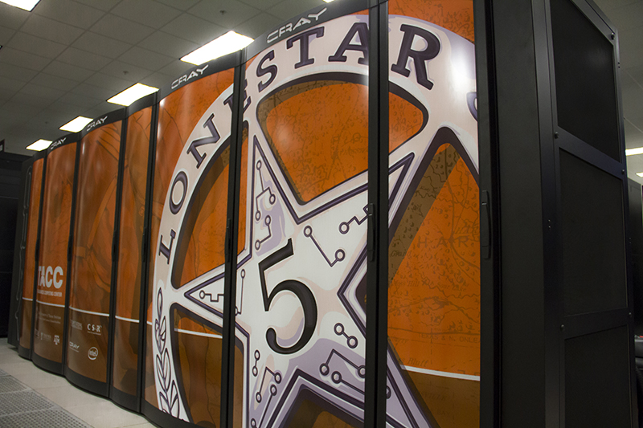

## Lonestar5 Basics

<center></center>

Lonestar5 has a complex architecture consisting of a few different types of nodes:

### Architecture

 * 1252 24-core general compute nodes (~30K cores total)
 * 16 GPU nodes
 * 10 large memory nodes
 * 80 TB memory, 5 PB disk storage, 1.2 PF peak performance

Login Nodes:

 * Dual Socket
 * Xeon CPU E5-2650 v3 (Haswell): 10 cores per socket (20 cores/node), 2.30GHz
 * 128 GB DDR4-2133
 * Hyperthreading Disabled

Compute Nodes:

 * Dual Socket
 * Xeon E5-2690 v3 (Haswell): 12 cores per socket (24 cores/node), 2.6 GHz
 * 64 GB DDR4-2133 (8 x 8GB dual rank x8 DIMMS)
 * No local disk
 * Hyperthreading Enabled - 48 threads (logical CPUs) per node

GPU Nodes:

 * Single Socket
 * Xeon E5-2680 v2 (Ivy Bridge): 10 cores, 2.8 GHz, 115W
 * 64 GB DDR3-1866 (4 x 16GB DIMMS)
 * Nvidia K40 GPU 12 GB GDDR5 (4.2 TF SP, 1.4TF DP)
 * Hyperthreading Enabled - 20 threads (logical CPUs) per node

Large Memory Nodes (Haswell):

 * Dual Socket
 * Xeon E5-2698 v3 (Haswell): 16 cores per socket (32 cores/node), 2.3 GHz
 * 512 GB RAM
 * Hyperthreading Enabled - 64 threads (logical CPUs) per node

Large Memory Nodes (Ivy Bridge):

 * Quad Socket
 * Xeon E7-4860 v2 (Ivy Bridge): 12 cores per socket (48 cores/node), 2.26 GHz
 * 1 TB RAM
 * Hyperthreading Enabled - 96 threads (logical CPUs) per node

Because there are two different chip microarchitectures (Haswell and Ivy Bridge), we must take an extra step when compiling code so that it is optimized for both. Specifically we use `-xAVX -axCORE-AVX2` flags when compiling so that a single binary can be used on both architectures. (More on this later).

### File Systems

You have access to the following spaces (5-digit lustre number and username vary for each user):
```
/home1/03439/wallen/      # 5 GB quota
/work/03439/wallen/       # 1 TB quota
/scratch/03439/wallen/    # unlimited quota, but subject to purge
```

Shortcuts to switch between the three spaces are:
```
$ cd
$ cdw
$ cds
```

Or:
```
$ cd $HOME
$ cd $WORK
$ cd $SCRATCH
```

### Compilers

To identify available gcc and intel compilers, try:
```
$ module spider gcc
...
  Versions:
     gcc/4.9.3
     gcc/5.1.0
     gcc/5.2.0
...
$ module spider intel
...
  intel: intel/16.0.1
...
```

Loading a `gcc` module will put these compilers in your path:
  * `gcc` (C compiler)
  * `g++` (C++ compiler)
  * `gfortran` (Fortran compiler)

Loading an `intel` module will put these compilers in your path:
  * `icc` (C compiler)
  * `icpc` (C++ compiler)
  * `ifort` (Fortran compiler)

For MPI programming, the MPICH implementation of the MPI standard is available as:
```
$ module spider cray_mpich
```

Loading the `cray_mpich` module will put the compilers `mpicc`, `mpicxx`, and `mpif90` in your path.


### Common Dependencies

Many programs you install will depend on some other program already being installed and in your path. This information is typically included in the online documentation or install instructions for the program you are trying to install. A good rule of thumb is to check if the dependency already exists on Lonestar5 before trying to install it yourself. Check out these modules on Lonestar5 which are common dependencies for other packages:
```
$ module spider mkl
$ module spider fftw
$ module spider hdf5
$ module spider cmake
$ module spider gsl
$ module spider qt
$ module spider boost
```


### Exercise

1. Try loading gcc and intel compilers at the same time. What happens?
2. Determine recommended compiler / dependencies for a software package you use. Are they available on Lonestar5?

[Click here for solution](hpc_software_environment_02_solution.md)


Previous: [HPC Software Environment](hpc_software_environment_01.md) | Next: [Installing an Application](hpc_software_environment_03.md) | Top: [Course Overview](../../index.md)

