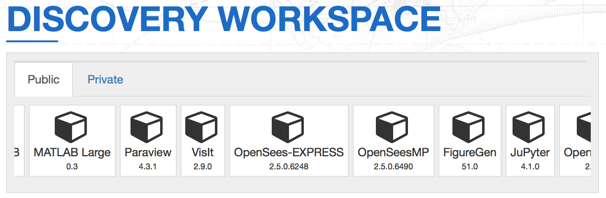
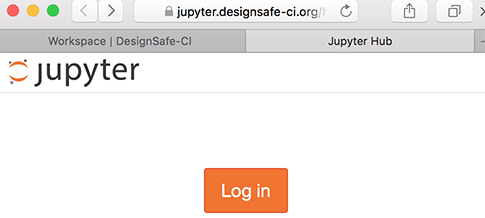
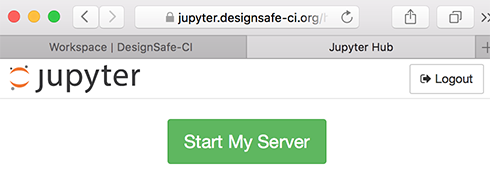
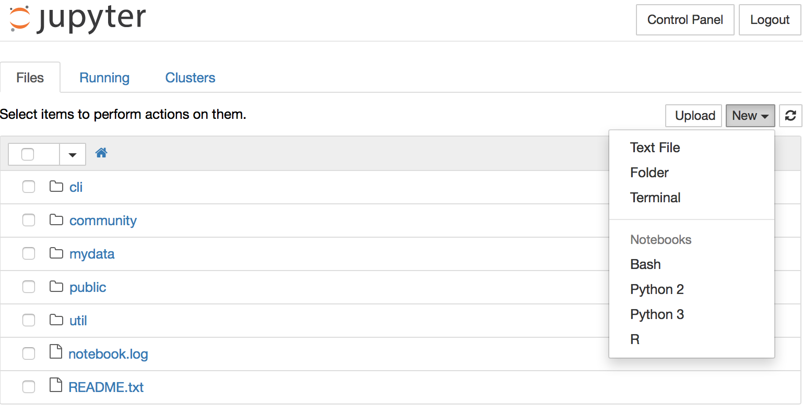
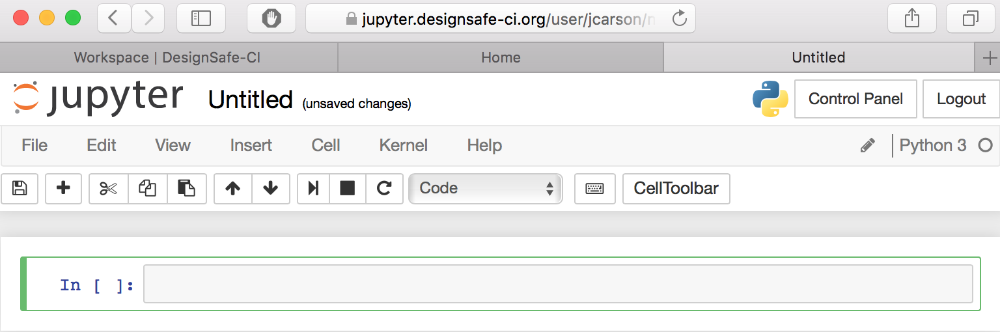

# Accessing Jupyter Notebook via DesignSafe-CI

## About DesignSafe

DesignSafe is the Cyberinfrastructure for the Natural hazards Engineering Research Infrastructure.  DesignSafe supports data storage, research workflows, data analysis, and visualization.  In addition, DesignSafe serves as a model for research computing in other fields.

A component of DesignSafe's Research Workbench is a Jupyter Notebook.  Please feel free to use this resource for your work.

## How to start up the Jupyter Notebook

**A TACC account is assumed for the following instructions**

---
* Browse to **www.designsafe-ci.org** and click on **Log in**

---

* Click on the **TACC** icon to log in using your TACC account

---

* Select **Workspace** in the **Research Workbench** menu

---

* Scroll right in the list of apps and click on **JuPyter**

---

* Click **Launch**

---

* Click **Log in**

---

* Click **Start my Server**

---

* On the right, click **New** and select **Python 3**

---

* Jupyter should open and you should see the following

---

Back: [Getting Started with Jupyter](intro_to_python_011_jupyter.md) | Top: [Python Overview](intro_to_python.md)
